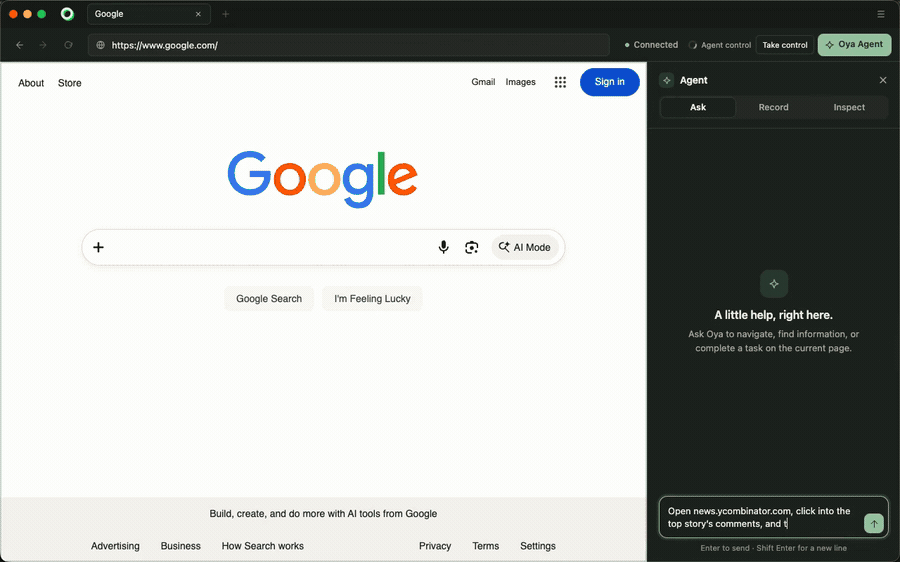

<p align="center">
  
</p>

<h3 align="center">Everyone else drives Chrome from the outside. We built the browser.</h3>

<p align="center">
  The automation lives inside it, not attached over the debugging protocol, so your agents stop<br>
  looking like a harness. Sign in once and every browser you start is already signed in.<br>
  Do the task once and Oya replays it forever, with no model in the loop.
</p>

<p align="center">
  <a href="https://www.npmjs.com/package/@oya-ai/browser"></a>
  <a href="LICENSE.md"></a>
  <a href="https://browser.getoya.ai"></a>
</p>

## Start

```bash
npm i @oya-ai/browser
```

```js
import { Oya } from "@oya-ai/browser";

const browser = await new Oya().browser.start();     // real Chrome, yours for the session
await browser.goto("https://news.ycombinator.com");
console.log(await browser.ask("What are the top 3 stories?"));
await browser.stop();
```

```
DONE: The top 3 stories on Hacker News are:
1. Google's Open Agentic Orchestrator
2. Samsung is expected to more than double output of its HBM4 and HBM4E DRAM
3. What happened to the Snowden archive
```

Set `OYA_API_KEY` from [browser.getoya.ai](https://browser.getoya.ai). Node 20+.

No provider set up yet? Open the [desktop browser](https://browser.getoya.ai) on the same
key and `start()` hands that one over, so those five lines work with nothing else
configured. `npx @oya-ai/cli init` picks where browsers run when you want it to start them.

## Record it once, replay it forever

`ask()` costs a model call every time. Save the run and it never costs one again.

```js
await browser.ask("Log in with {{user}} and {{pass}}. Open New Request for {{name}}.",
  { data: { name: "Alex Example" }, secrets: { user, pass } });
await browser.toPlaybook("new-request");             // the steps it just took

await replay.play("new-request", { name: "Sam Example", user, pass });   // no model, new inputs
```

Nine of ten public sites replay every recorded step with no model and no repair.
[The tenth is named, with its error](docs/replay-benchmark.md). When a page really has changed,
the agent fixes it and leaves you a draft to approve. Every playbook is also a Playwright module
you can read and keep.

## Sign in once

Scripted logins break on Google SSO, Okta, passkeys and Cloudflare. Don't script them. Sign in
by hand once in the [desktop app](https://browser.getoya.ai), and every browser you start on that
persona is already signed in: the session travels as cookies **and localStorage**, sealed at
rest, because half the portals worth automating keep you signed in with neither one alone.

For the portals that end the session server-side anyway, store the login and Oya signs in itself,
and stops rather than retrying a password the site has already refused, because that is how a
real account gets locked out.

## Why it isn't flagged as a bot

Everyone else ships an SDK that drives headless Chrome over the debugging protocol. That is the
easy way, and it is the shape anti-bot vendors have learned to look for. Oya is a real headful
browser a person can sit in front of, and the automation runs inside the process:

- The persona's platform, timezone, locale, cores and screen are set through **Chrome's own
  emulation** before the first document, and again in workers and cross-site iframes. A value
  Chrome reports about itself cannot be caught lying.
- Reading a page uses an isolated world, so it needs no `Runtime.enable`, which is a known detection
  vector. Replay never turns it on.
- Console and network come from browser-process APIs, not the `Log` and `Network` domains, so
  watching a run adds nothing a page can see.

Measured, not asserted: **0% CreepJS headless score** (bare headless Chrome: 100%) and
**31 of 31** Bot.Sannysoft, re-run on 2026-09-20. Nobody can promise you are never detected ([our own numbers
page says so](docs/stealth.md)), but you can run the harness yourself and see what it says.

## Self-host

```bash
npx @oya-ai/cli install
```

Six questions, then it clones, writes the config, builds and waits for `/readyz`.
SQLite, Postgres or Supabase; browsers on Docker, Kubernetes or your own machines.

## Give it to your agent

```bash
claude mcp add --transport http oya https://browser.getoya.ai/mcp/pool \
  --header "Authorization: Bearer $OYA_API_KEY"
```

Then just ask: *"Start a browser, open Hacker News and summarise the top 3 stories."*
Also [Cursor, Claude Desktop and any agent that reads skills](https://browser.getoya.ai/docs).

<p align="center">
  
</p>
<p align="center"><sub>The browser itself, filmed in real time: a task asked in the Ask pane, the answer, and the run kept as a playbook. The green boxes are the page as the agent reads it: every element it can act on, numbered. <a href="assets/oya-demo.mp4">The four-minute version</a> goes on to LinkedIn already signed in, Amazon, and a login it completes by itself (subtitles included).</sub></p>

## The rest

| | |
|:--|:--|
| **CAPTCHA and 2FA** | Solved where they can be, handed to a person where they can't |
| **It proves what it did** | A hash-chained audit trail the database won't let you rewrite, host allow-listing, [regenerable evidence](compliance/EVIDENCE.md) |
| **It isn't one vendor** | Oya Cloud, Browserbase, Steel, Anchor, Browser Use or your own Chrome ([why](docs/why-oya.md)) |
| **It keeps your tools** | Every browser has a `cdpUrl`, so Playwright and Puppeteer connect unchanged |
| **Full docs** | [SDK](packages/sdk) · [CLI](packages/cli) · [self-hosting](docs/self-hosting.md) · [examples](examples) · [browser.getoya.ai/docs](https://browser.getoya.ai/docs) |

## Packages

| Package | |
|:---|:---|
| [`@oya-ai/browser`](packages/sdk) | TypeScript SDK. ESM and CJS, typed, zero runtime dependencies. |
| [`@oya-ai/cli`](packages/cli) | The fleet, the live view, the installer. |
| [`server`](server) · [`ui`](ui) · [`browser`](browser) | Control plane, console, and the browser itself. |

```bash
npm test                 # the whole suite
cd server && npm run stealth -- --live   # the stealth numbers, on your machine
```

## License

The [SDK](packages/sdk) and [CLI](packages/cli) are MIT. Embed them in commercial agents.
Everything else is source-available under the [Sustainable Use License](LICENSE.md): free for
internal business use, research and non-commercial use.
