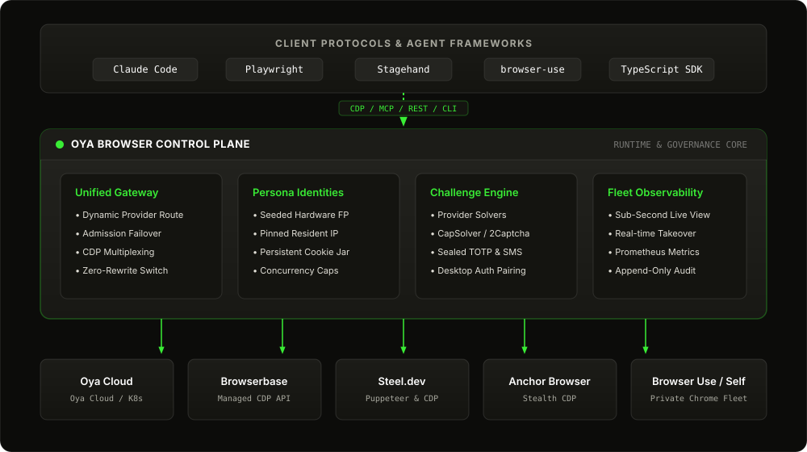

# Why route through Oya rather than a vendor directly

Every cloud-browser vendor has its own API, session model and outages. Couple your agents to one
and you inherit all three.

  

| | One vendor, directly | Through Oya |
|:---|:---|:---|
| **Switching vendors** | Rewrite against a new API | Change a setting on the key |
| **Vendor outage at connect** | Your agents are down | `/connect` falls through to the next route |
| **Device identity** | Whatever the vendor offers per session | A persona: seeded fingerprint, cookie jar and proxy, stable across runs |
| **Stealth** | The vendor's claims | [0% CreepJS headless, 31/31 Sannysoft](stealth.md), reproducible with `oya stealth-test --live` |
| **Logins** | Scripted login flows | Sign in once on the desktop; remote personas inherit the cookies, and stored credentials cover portals that expire them |
| **CAPTCHA and MFA** | Vendor-specific, or build it yourself | Native solver where there is one, CapSolver or 2Captcha otherwise, sealed TOTP, codes read out of Gmail or Microsoft 365 by your own LLM, live takeover |
| **Repeatable tasks** | Build and maintain your own scripts | Record playbooks, replay with new inputs, and review agent repair drafts |
| **Fleet operations** | One dashboard per vendor | One console, Prometheus `/metrics`, spend per key, stop-all |
| **Proving what happened** | Session logs, as offered | A [hash-chained audit trail](../README.md#provable) the database will not let you rewrite, host allow-listing shared by browser and proxy, and an evidence pack you regenerate |

**6 backends**: Oya Cloud, Browserbase, Steel, Anchor, Browser Use, your own Chrome, behind **4 surfaces**: CDP, MCP, REST and the SDK.
