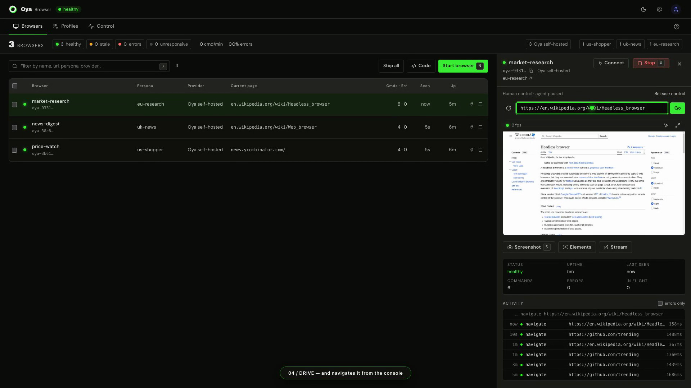

# Oya Browser Control Plane UI

<p align="center">
  <strong>The high-density web console, interactive streaming viewer, and public portal for Oya Browser.</strong>
</p>

<p align="center">
  
</p>

Built with **Next.js 16 (App Router)**, **Tailwind CSS v4**, and **Lucide React**. It's designed for watching a large fleet: a JPEG-over-SSE live view, a command log for each browser, and human takeover.

---

## 🎛️ Operational Surfaces


### 1. The Fleet Console (`/dashboard`)

The core command center is divided into three unified workspaces with instant keyboard navigation (`⌘1`, `⌘2`, `⌘3`):

#### 🚀 Browsers Workspace (`⌘1`)
- **Fleet Health Strip:** Real-time status counters (*Healthy*, *Stale*, *Errors*, *Unresponsive*). Click any count to filter the fleet.
- **High-Density Fleet Grid:** Live view of active instances, assigned personas, provider routes, active URLs, execution command counts, error rates, and uptimes.
- **Inspector Panel:** Slide-over panel featuring real-time URL navigation, viewport screenshot viewer, numbered element tree inspector, and chronological command activity feed.
- **Sub-Second Live View & Takeover:** Low-latency JPEG stream over SSE supporting pixel-accurate mouse click, drag, scroll, and batched keyboard typing for immediate human takeover during complex challenges or MFA prompts.
- **Fleet Kill Switch:** Bulk or granular emergency termination (`POST /api/browsers/stop { all: true }`) to halt runaway agent loops and tear down cloud sandboxes immediately.

#### 🛡️ Profiles Workspace (`⌘2`)
- **Deterministic Identity Engine:** View and manage mathematically seeded hardware profiles (Canvas noise, WebGL GPU renderer, Web Audio signature, client rects, system fonts, and navigator attributes).
- **Concurrency & Rate Governance:** Set hard concurrency caps per persona (e.g. 2 sessions per persona) to protect against device-farm heuristics.
- **Credentials & MFA Vault:** Manage sealed TOTP secrets (encrypted with AES-256-GCM at rest) and SMS/email relay webhooks.
- **Live Fingerprint Preview:** Interactive generator displaying exact hardware characteristics prior to persona instantiation.

#### ⚖️ Control & Governance Workspace (`⌘3`)
- **Multi-Provider Routing:** Configure priority routes and capacity ceilings across Oya Cloud, Browserbase, Steel, Anchor, Browser Use, or private CDP nodes.
- **CDP Gateway Monitor:** Track active client connections to the `/connect` gateway with session recording controls.
- **Spend & Resource Metering:** Real-time hourly cost attribution across sandbox compute, LLM model tokens, and residential proxy bandwidth.
- **Append-Only Security Audit:** Tenant-isolated log recording every administrative action, cookie synchronization, and security event.

---

### 2. Standalone Live Viewer (`/live/[browserId]`)

A dedicated, full-screen interactive canvas for remote monitoring, QA verification, and human intervention without console chrome.

### 3. Documentation & API Explorer (`/docs`)

Built-in documentation covering:
- Architecture specifications & comparison matrices
- Multi-provider dynamic failover setups
- Live stealth verification benchmarks (`oya stealth-test --live`)
- Full REST, WebSocket, and Command API references
- Fast keyboard search (`/`)

---

## ⌨️ Keyboard Shortcuts

| Shortcut | Action |
|:---|:---|
| `⌘/Ctrl 1 · 2 · 3` | Switch between Browsers, Personas, and Control workspaces |
| `n` | Provision a new browser instance |
| `/` | Focus search / fleet filter |
| `↑ ↓` or `j k` | Navigate browser fleet rows |
| `x` | Terminate selected browser(s) |
| `l` | Focus URL address bar |
| `r` | Reload active page |
| `s` | Capture instant viewport screenshot |
| `Esc` | Close inspector panel or release keyboard focus from live stream |
| `?` | Toggle keyboard shortcuts cheat sheet |

---

## 🛠️ Development & Build

```bash
# Install dependencies
npm install

# Start development server on :3000
npm run dev

# Run TypeScript typecheck and Next.js production build
npm run build

# Start production server
npm run start

# Run end-to-end Playwright UI integration tests
npm run test:ui
```

---

## ⚙️ Environment Variables

| Variable | Default | Description |
|:---|:---|:---|
| `NEXT_PUBLIC_API_URL` | `/api` | Base HTTP endpoint for the Oya control plane backend |
| `NEXT_PUBLIC_SITE_URL` | `https://browser.getoya.ai` | Canonical site URL for metadata, sitemap and links |

---

## 📄 License

[Sustainable Use License](../LICENSE.md). Only `packages/sdk` and `packages/cli` are MIT.
